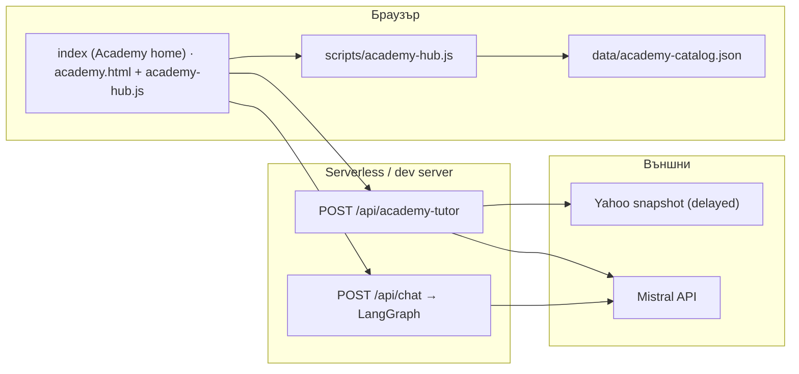
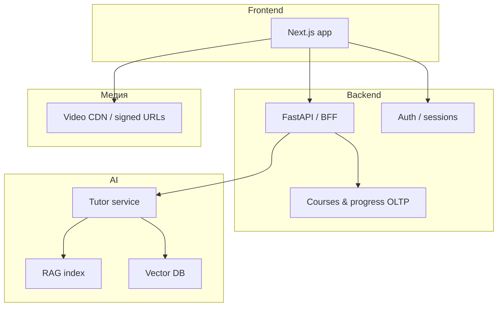

# AgriNexus Academy — архитектурен скиц

Кратък технически изглед: какво **има днес** в репото и как се разгръща към целевия стек (`docs/TARGET-ARCHITECTURE.md`).

## 1. Поток днес (статичен сайт + API)

- **Каталог и търсене:** `academy-hub.js` зарежда JSON, рендерира мрежата и визуалните уроци; език чрез `window.AGN_ACADEMY_LANG`.
- **Academy Tutor:** `api/academy-tutor.ts` — rate limit, системен промпт + `fetchMarketSnapshotForLlm()` за **учебен** контекст, `getChatMistral()`.
- **Mesh:** `api/chat.ts` — оркестратор; при маршрут **ACADEMY_AGENT** отделен node с академичен фокус (виж `academyAgent`).

## 2. „AI фермерски мозък“ — мапинг към слоевете

Продуктовите четири стълба (виж `docs/ACADEMY_PRODUCT_VISION.md` §3) се подреждат към **Sense → Think → Act** и към образователния слой:

| Стълб | Смисъл | Типичен слой | Днес в репото (ориентир) |
|--------|--------|--------------|---------------------------|
| Учи фермера | Курсове, наставник, грамотност | Academy + UX над данни | `academy.html`, `academy-hub.js`, `api/academy-tutor.ts`, `ACADEMY_AGENT` в `api/chat.ts` |
| Анализира фермата | Сигнали, обобщения, аномалии | Sense (+ data lake в целевия стек) | Пазарен snapshot за LLM, страници за пазар/аналитика; бъдещи полеви/IoT канали със съгласие |
| Дава решения | Варианти, обяснения, риск | Think | LangGraph оркестрация, специализирани агенти в `api/chat.ts` |
| Автоматизира дейности | Сценарии, интеграции | Act | Маркетинг/продуктов слой на `platform.html` и табло; бъдещи playbook API и одит |

Граници: автоматизацията винаги минава през **разрешения**, регионални правила и (където е нужно) **човек преди действие**.

## 3. Локална разработка

При `npm run dev`, `scripts/dev-server.mjs` трябва да проксира същите маршрути като продукцията. **`POST /api/academy-tutor`** е регистриран там, за да работи панелът „Ask the Academy Tutor“ без 404.

## 4. Целева архитектура (фаза LMS)

- **Идентичност и прогрес:** PostgreSQL (или еквивалент), отделно от статичните HTML.
- **RAG:** одобрени документи + embeddings; политики в `api/lib/agrinexus-policy.ts` като отправна точка за текстови правила. Пълното описание на бъдещата RAG архитектура може да намерите в [ACADEMY_RAG_ARCHITECTURE.md](ACADEMY_RAG_ARCHITECTURE.md).
- **Видео:** отделен доставчик; ключове и URL-и през backend, не хардкод в клиента.

## 5. Файлове за бърза навигация

| Компонент | Път |
|-----------|-----|
| Tutor handler | `api/academy-tutor.ts` |
| LangGraph mesh | `api/chat.ts` |
| Пазарен snapshot за LLM | `api/lib/market-snapshot.ts` |
| Политика | `api/lib/agrinexus-policy.ts` |
| Каталог | `data/academy-catalog.json` |
| Клиент логика | `scripts/academy-hub.js` |
| Dev сървър | `scripts/dev-server.mjs` |

## 6. Сигурност и съответствие

- Rate limits: `AGN_ACADEMY_RATE_LIMIT_PER_MIN`, IP от `clientIpFromVercelRequest`.
- Логове: JSON редове за операции (`docs/AI-OPERATIONS.md`).
- Бъдещи стъпки: съгласие за полеви данни, роли (учащ / админ / партньор), съхранение на чат история с retention.
