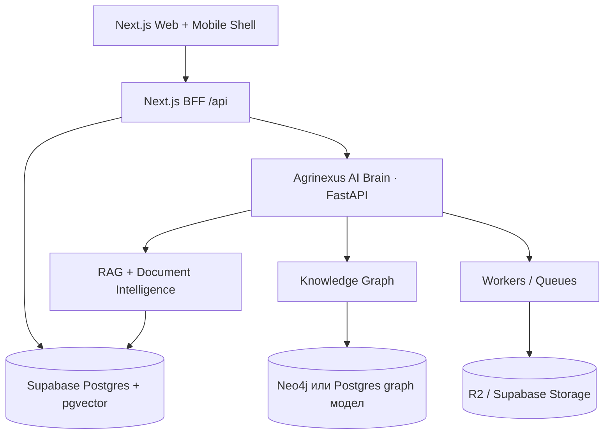

# Agrinexus 2.0 · Enterprise roadmap

## Позициониране

Agrinexus не трябва да се развива като още един земеделски сайт, а като **операционна система за агробизнеса**.

Целевата платформа обединява:

| Модул | Роля |
|-------|------|
| **Agrinexus Core** | Профили, потребители, ферми, права, billing, audit logs |
| **Agrinexus Law** | Правни документи, договори, наредби, рискове, срокове |
| **TerraIQ** | Парцели, почви, култури, сателитни/агро данни |
| **Agri Academy** | Курсове, тестове, сертифициране, учебно съдържание |
| **Marketplace** | Услуги, продукти, оферти, партньори |
| **Agrinexus AI Brain** | Общ AI слой за чат, RAG, document intelligence и автоматизация |

## Какво е силно днес

| Област | Оценка |
|--------|--------|
| **Web платформа** | Next.js приложение с production насоченост |
| **Mobile основа** | Capacitor подготовка за Android/iOS |
| **AI/RAG** | Hybrid retrieval, pgvector, ingest и fallback логика |
| **Supabase backend** | Postgres, pgvector, storage-ready модел |
| **Admin зона** | Диагностика, ingest/reindex контрол |
| **Документация** | Има начална архитектурна документация и deployment guide |

## Най-голям технически риск

Проектът трябва да остане **source-only** в Git/архивите. Не трябва да се пазят:

| Артефакт | Причина |
|----------|---------|
| `node_modules/` | Десетки хиляди файлове, възстановява се с `npm install` |
| `.next/` | Компилиран build, специфичен за средата |
| `.gradle/` и `build/` | Локални Android/Gradle кешове |
| `.env*` | Тайни и production credentials |
| IDE папки | Машинно специфични настройки |

Root `.gitignore` трябва да е активен преди следващ commit. Ако тези файлове вече са проследени от Git, трябва да се премахнат от индекса с `git rm --cached`, без да се трият локално.

## Целева архитектура

## Agrinexus AI Brain

Общият AI слой трябва да обслужва всички продукти:

| Capability | Описание |
|------------|----------|
| **Chat orchestration** | Единен router към RAG, статични знания, learned knowledge и tool actions |
| **RAG services** | Индексиране, retrieval, citations, metadata filters |
| **Document intelligence** | Клаузи, рискове, резюмета, действия, срокове |
| **User/case memory** | История на случаи, решения, документи и AI анализи |
| **Audit logs** | Проследимост: кой, кога, върху кой документ, какъв отговор |
| **Evaluation** | Regression тестове за retrieval и качество на отговорите |

## Knowledge Graph

Следващият голям скок над стандартен RAG е knowledge graph, който свързва:

| Entity | Примери |
|--------|---------|
| **Документи** | договори, заповеди, наредби, програми |
| **Ферми** | стопанства, култури, животни, активи |
| **Парцели** | имоти, площи, землища, ограничения |
| **Фирми** | доставчици, купувачи, партньори |
| **Курсове** | уроци, тестове, сертификати |
| **Случаи** | въпроси, анализи, решения, препоръчани действия |

Първа версия може да започне в Postgres с relation tables. Neo4j е подходящ, когато graph заявките станат централна част от продукта.

## Document Intelligence

Agrinexus Law може да стане самостоятелен силен продукт чрез pipeline:

1. **Upload** — PDF/DOCX/изображение към storage.
2. **Extract** — текст, OCR, metadata.
3. **Classify** — договор, заповед, наредба, програма, уведомление.
4. **Analyze** — клаузи, рискове, срокове, липсващи данни.
5. **Recommend** — следващи действия, писма, checklist.
6. **Persist** — case memory, версии, audit trail.

Важно продуктово правило: да се позиционира като **AI Legal Assistant for Agricultural Documents**, не като заместител на адвокат.

## Executive Cockpit

За инвеститори и management е нужен един екран с:

| KPI | Източник |
|-----|----------|
| Активни потребители | auth/events |
| Качени документи | storage/document tables |
| AI заявки | chat logs / request logs |
| Използване по модули | events + route analytics |
| RAG health | `knowledge_chunks`, embeddings coverage |
| Приходи | billing/provider events |

Този cockpit трябва да бъде отделен admin route с read-only агрегирани метрики.

## Приоритетен план

| Фаза | Цел | Резултат |
|------|-----|----------|
| **0. Repo hygiene** | Чист Git, без build artifacts | Малък архив, бърз clone, безопасни secrets |
| **1. Product boundaries** | Ясни модули и ownership | Core/Law/TerraIQ/Academy/Marketplace карта |
| **2. AI Brain contract** | Единен API за AI capabilities | FastAPI/OpenAPI + Next BFF proxy |
| **3. Document Intelligence MVP** | Реален Law workflow | Upload → extract → analyze → case memory |
| **4. Executive Cockpit** | Видимост за бизнес метрики | Admin dashboard с KPI |
| **5. Graph layer** | Свързани знания и случаи | Query върху документи, ферми, парцели и решения |

## Definition of ready for 10 000+ потребители

| Област | Минимално изискване |
|--------|---------------------|
| **Security** | RLS, service-role само server-side, audit logs, secret scanning |
| **Performance** | Кеширане, pagination, rate limits, background jobs |
| **Reliability** | Health checks, retries, dead-letter queue за ingest |
| **Observability** | Error tracking, request logs, AI cost metrics |
| **Data model** | Миграции, индекси, ownership по tenant/user |
| **AI quality** | Retrieval evals, prompt regression tests, citation policy |
| **Operations** | CI pipeline, preview deploys, backup/restore план |
