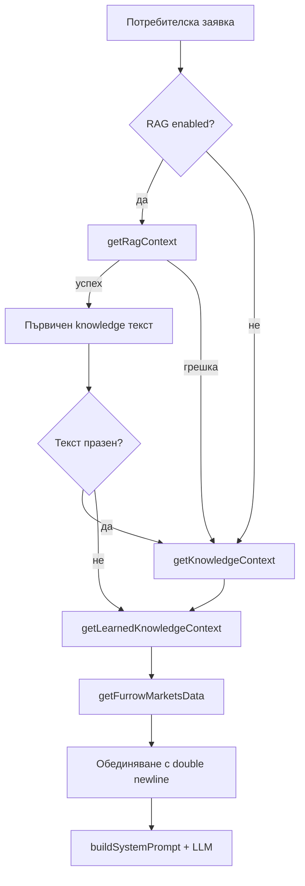
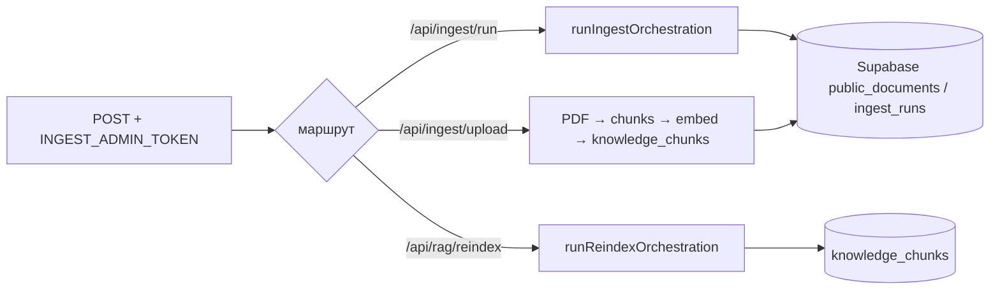
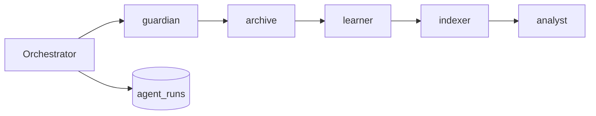

# AI лидер — архитектура и автоматизация между звената

Този документ описва **оркестрацията** на AI компонентите в AgriNexus MVP: как отделните „звена“ се подреждат, кога се включват fallback-и и къде е единната точка в кода.

## Какво е „AI лидерът“

**AI лидерът** е слой, който **автоматизира реда и fallback логиката** между:

| Звено | Роля |
|--------|------|
| **RAG hybrid** | Vector (Supabase `knowledge_chunks` + embeddings) + lexical (BM25/RRF) чрез `getRagContext` |
| **Статична ДФЗ база** | Lexical контекст от `getKnowledgeContext`, ако RAG не даде текст |
| **Learned knowledge** | Допълнителен контекст от Supabase (`getLearnedKnowledgeContext`) |
| **Furrow snapshot** | Локален JSON (`furrow-knowledge.json`) през `getFurrowMarketsData` |

Единната функция в код: **`runChatKnowledgePipeline`** в `lib/ai-leader/chat-knowledge-pipeline.ts`.  
`app/api/chat/route.ts` я извиква преди да се построи system prompt и да се стриймне отговорът от OpenAI.

## Последователност (автоматизация)

- **Retrieval mode** за заглавките `X-Retrieval-Mode` / логове: `rag_hybrid` (има vector принос), `bm25` (само lexical/RAG без vector или статична база), `none` (няма retrieval текст преди learned/furrow).

## AI лидер — Ingest и RAG reindex

Отделен pipeline от чата: **индексиране и админ операции**, не streaming към потребителя.

| Звено | Функция / вход |
|--------|------------------|
| **Админ auth** | `isIngestAdminAuthorized` — един токен за `/api/ingest/run`, `/api/ingest/upload`, `/api/rag/reindex` |
| **Document / web ingest** | `runIngestOrchestration` — тяло като досегашния POST към `/api/ingest/run` |
| **Reindex по източник** | `runReindexOrchestration` + `parseReindexTarget` — същите `target` стойности като в `/api/rag/reindex` |

## Разширяване

1. Добавяне на ново звено: разширете `runChatKnowledgePipeline` и документирайте реда тук.
2. Нови API маршрути, които трябва същия **чат** контекст: импортирайте `runChatKnowledgePipeline` от `@/lib/ai-leader` вместо да копирате логика.
3. Нови **ingest/reindex** стъпки: разширете `lib/ai-leader/ingest-reindex-pipeline.ts` и тествайте през съществуващите API или скриптове в `scripts/`.

## Пет AI агента — една система

Оркестраторът (`runAgentOrchestrator`) пуска агентите в този ред. Всеки run записва метрики в `agent_runs` (виж `supabase-agent-runs.sql`) и чете предишни run-ове за адаптивни лимити.

| ID | Име | Роля |
|----|-----|------|
| `guardian` | Пазител | Env, RAG, Supabase, billing health |
| `archive` | Архивар | ДФЗ/МЗХ → архив → RAG → Meili |
| `learner` | Учен | 👍 chat feedback → `knowledge_learned_items` |
| `indexer` | Индексатор | Embeddings + Meili sync |
| `analyst` | Аналитик | Engagement метрики и препоръки |

**API:** `GET /api/agents/cron` (cron) · `POST /api/agents/run` (admin) · `GET /api/agents/run` (списък)

**Admin UI:** `/admin` → „AI Leader — 5 агента“

---

## Свързани файлове

- `lib/ai-leader/chat-knowledge-pipeline.ts` — оркестрация за чат
- `lib/ai-leader/admin-ingest-auth.ts` — админ токен за ingest / upload / reindex
- `lib/ai-leader/ingest-reindex-pipeline.ts` — `runIngestOrchestration`, `runReindexOrchestration`
- `lib/ai-leader/index.ts` — реекспорт
- `lib/ai-leader/agents/` — registry, orchestrator, 5 agents
- `app/api/agents/cron/route.ts` — планиран run
- `app/api/agents/run/route.ts` — admin run
- `lib/rag/hybrid-search.ts` — RRF + hybrid retrieval
- `lib/rag/config.ts` — прагове, embedding модел, `RAG_ENABLED`
